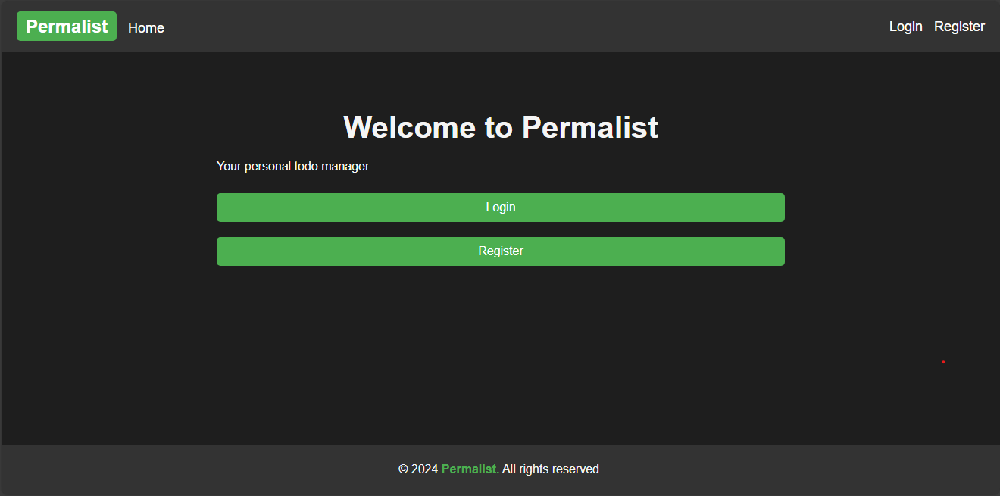
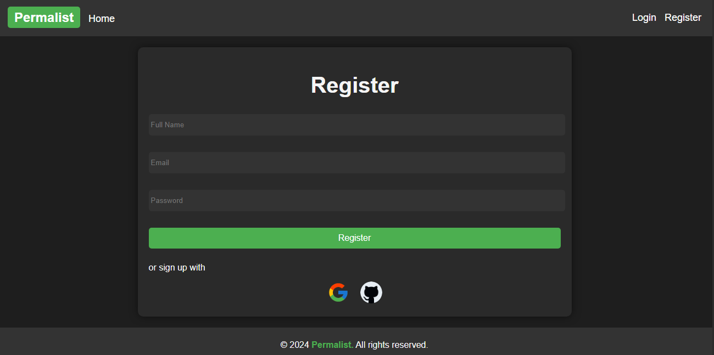
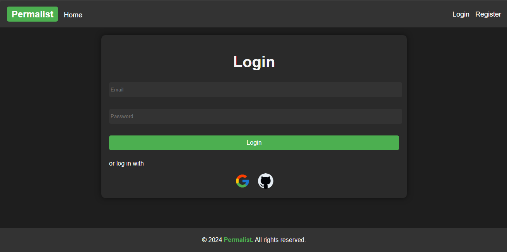
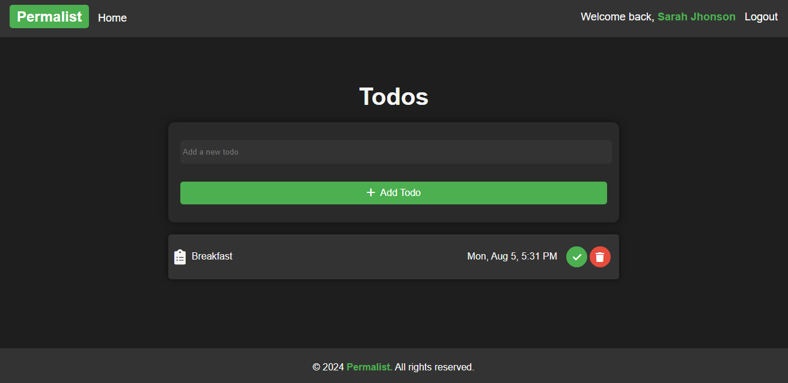

# 📝 Permalist


Permalist is a full-stack Todo application where users can register, add, edit, and delete todos. The app supports Google and GitHub OAuth authentication and provides a sleek, responsive user interface with a dark color scheme.

## 🚀 Features

- **User Authentication**: Register and log in using Google or GitHub.
- **CRUD Operations**: Create, read, update, and delete todos.
- **Responsive Design**: Mobile-friendly with a dark theme.

## 🛠️ Technologies

- **Frontend**: EJS, HTML, CSS
- **Backend**: Node.js, Express.js
- **Database**: PostgreSQL
- **Authentication**: Passport.js, Google OAuth, GitHub OAuth

## 📦 Installation

1. **Clone the repository**:

   ```bash
   git clone https://github.com/yourusername/permalist.git
   cd permalist
   ```

2. **Install dependencies**:

   ```bash
    npm install
   ```

3. **Set up environment variables:**:
   Create a `.env` file in the root directory and add the following environment variables:

   ```bash
    PG_USER=your_postgres_user
    PG_HOST=your_postgres_host
    PG_DATABASE=your_postgres_db
    PG_PASSWORD=your_postgres_password
    PG_PORT=your_postgres_port
    SESSION_SECRET=your_session_secret
    GOOGLE_CLIENT_ID=your_google_client_id
    GOOGLE_CLIENT_SECRET=your_google_client_secret
    GITHUB_CLIENT_ID=your_github_client_id
    GITHUB_CLIENT_SECRET=your_github_client_secret
   ```

4. **Run the server**:
   ```bash
   npm start
   ```
   The server will start at `http://localhost:3000`.

## 📚 Usage

1. **Home Page**: Provides a brief introduction and links to register or log in.

2. **Register/Login**: Sign up or log in using your email, Google, or GitHub account.

3. **Todos Page**: View, add, update, or delete your todos.

4. **Logout**: Click on the logout button to log out of your account.

## 📸 Screenshot






## 📝 License

This project is licensed under the MIT License. See the [LICENSE](LICENSE) file for more information.
